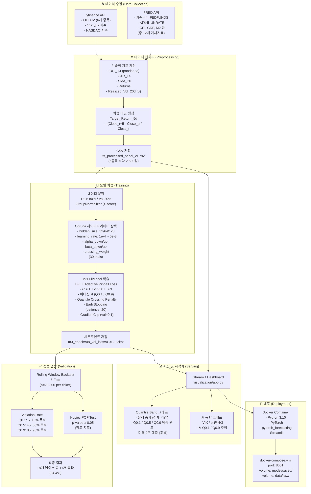

# M3 Full Model — 시스템 구조도



---

## 기술 스택

| 구분 | 기술 |
|------|------|
| **언어** | Python 3.10 |
| **딥러닝** | PyTorch, pytorch_forecasting |
| **데이터 수집** | yfinance, fredapi |
| **데이터 처리** | pandas, numpy, pandas-ta |
| **하이퍼파라미터 최적화** | Optuna |
| **학습 프레임워크** | PyTorch Lightning |
| **시각화** | Streamlit, Plotly |
| **통계 검증** | scipy, statsmodels |
| **배포** | Docker, Docker Compose |

---

## 일별 운영 흐름 (실서비스 기준)


> 재학습은 매월 or 분기 1회 수행 (성능 저하 감지 시)

---

## Docker 배포 구성 (예시)

```yaml
# docker-compose.yml
version: '3.8'
services:
  app:
    build: .
    ports:
      - "8501:8501"
    volumes:
      - ./model/saved:/app/model/saved
      - ./data/raw:/app/data/raw
    command: streamlit run visualization/app.py --server.port 8501
```

```dockerfile
# Dockerfile
FROM python:3.10-slim
WORKDIR /app
COPY requirements.txt .
RUN pip install -r requirements.txt
COPY . .
EXPOSE 8501
CMD ["streamlit", "run", "visualization/app.py"]
```
